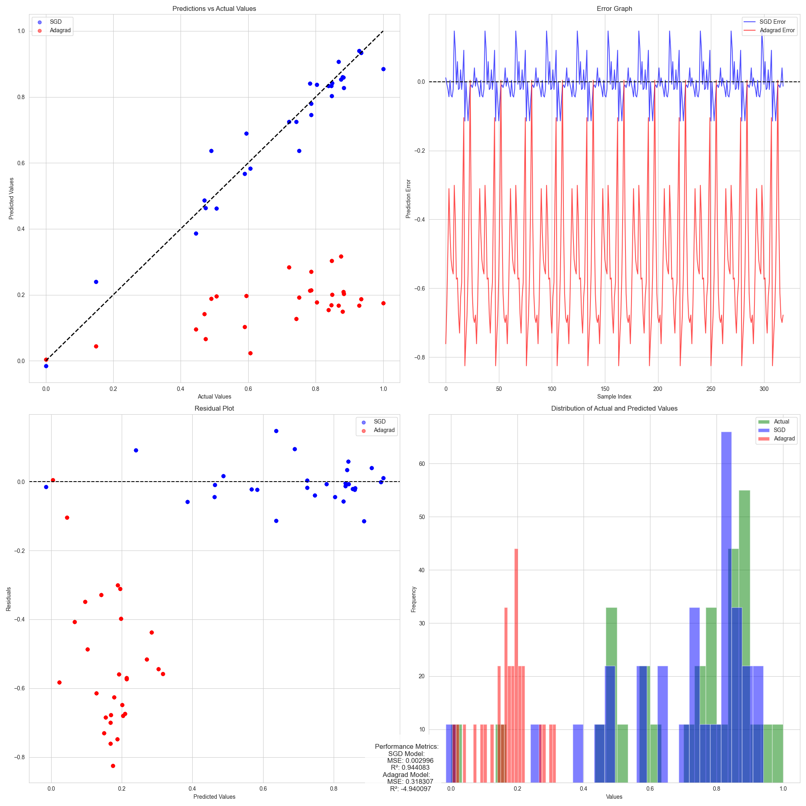
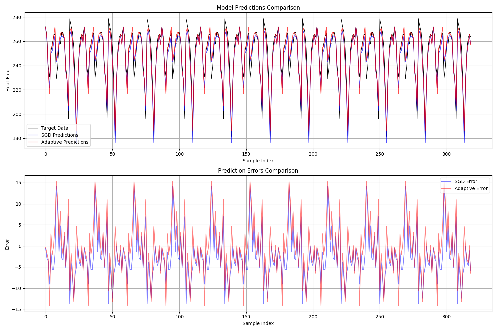
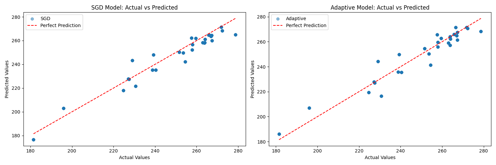
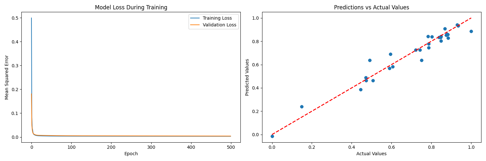
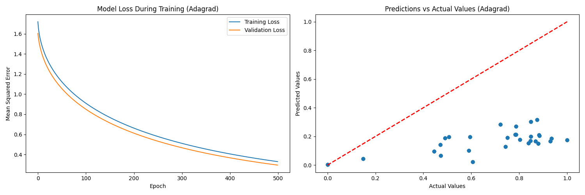
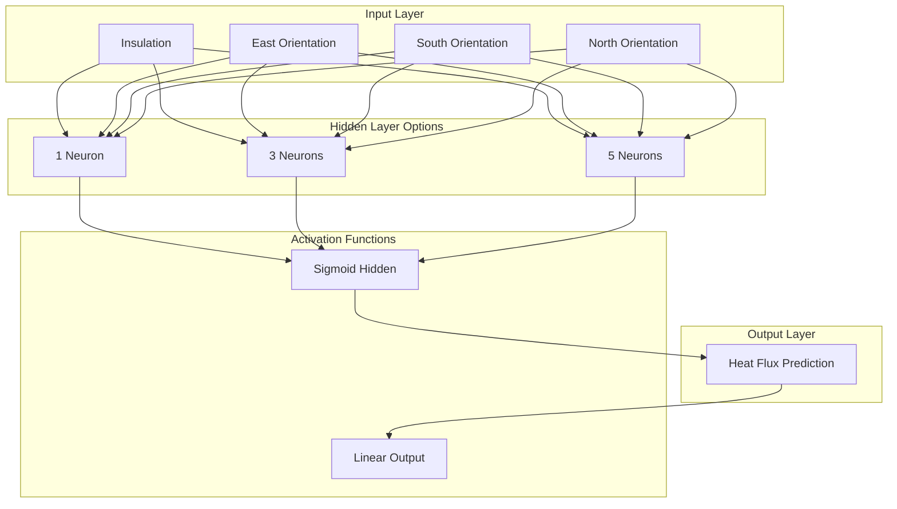
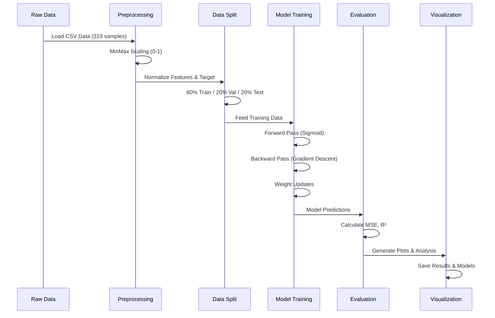

<div align="center"><a name="readme-top"></a>

[](#)

# 🧠 Heat Flux Perceptrons Neural Networks<br/><h3>Advanced Deep Learning for Thermal Analysis</h3>

A comprehensive neural network implementation project that demonstrates manual feedforward networks and multi-layer perceptrons for predicting heat influx into residential buildings.<br/>
Features step-by-step backpropagation calculations, multiple network architectures, and comparative analysis of optimization techniques.<br/>
Complete implementation from **theory to practice** with detailed mathematical derivations.

[🤗 Hugging Face Model][huggingface-link] · [📊 Live Demo][demo-link] · [📚 Documentation][docs-link] · [🐛 Issues][github-issues-link]

<br/>

[](https://huggingface.co/ChanMeng666/heat-flux-perceptrons-neural-networks)

<br/>

<!-- SHIELD GROUP -->

[![][github-release-shield]][github-release-link]
[![][github-stars-shield]][github-stars-link]
[![][github-forks-shield]][github-forks-link]
[![][github-issues-shield]][github-issues-link]
[![][github-license-shield]][github-license-link]<br/>
[![][python-shield]][python-link]
[![][tensorflow-shield]][tensorflow-link]
[![][jupyter-shield]][jupyter-link]<br/>
[![][sponsor-shield]][sponsor-link]

**Share Heat Flux Neural Networks**

[![][share-x-shield]][share-x-link]
[![][share-telegram-shield]][share-telegram-link]
[![][share-whatsapp-shield]][share-whatsapp-link]
[![][share-reddit-shield]][share-reddit-link]
[![][share-linkedin-shield]][share-linkedin-link]

<sup>🌟 Pioneering the future of thermal analysis through advanced neural networks. Built for researchers, students, and practitioners.</sup>

## 📸 Project Demonstrations

> [!TIP]
> Explore the visual results showcasing model performance and architectural comparisons.

<div align="center">
  
  <p><em>Comprehensive Model Performance Analysis - Different Architectures and Optimizers</em></p>
</div>

<div align="center">
  
  
  <p><em>Prediction Accuracy Comparison and Data Distribution Analysis</em></p>
</div>

<details>
<summary><kbd>📊 More Visualizations</kbd></summary>

<div align="center">
  
  <p><em>Training Progress and Validation Curves</em></p>
</div>

<div align="center">
  
  <p><em>Adagrad Optimizer Performance Comparison</em></p>
</div>

</details>

**Technical Stack:**

<div align="center">

 
 
 
 
 
 
 

</div>

</div>

> [!IMPORTANT]
> This project demonstrates advanced neural network implementations with manual backpropagation calculations, multiple architectures (1, 3, 5 hidden neurons), and comprehensive optimization strategies. Perfect for understanding deep learning fundamentals and thermal analysis applications.

<details>
<summary><kbd>📑 Table of Contents</kbd></summary>

#### TOC

- [🧠 Heat Flux Perceptrons Neural Networks](#-heat-flux-perceptrons-neural-networks)
      - [TOC](#toc)
  - [🌟 Introduction](#-introduction)
  - [✨ Key Features](#-key-features)
    - [`1` Manual Neural Network Implementation](#1-manual-neural-network-implementation)
    - [`2` Heat Flux Prediction System](#2-heat-flux-prediction-system)
    - [`*` Advanced Features](#-advanced-features)
  - [🛠️ Tech Stack](#️-tech-stack)
  - [🏗️ Architecture](#️-architecture)
    - [Neural Network Architecture](#neural-network-architecture)
    - [Data Flow](#data-flow)
    - [Model Components](#model-components)
  - [⚡️ Performance](#️-performance)
  - [🚀 Getting Started](#-getting-started)
    - [Prerequisites](#prerequisites)
    - [Quick Installation](#quick-installation)
    - [Running the Notebooks](#running-the-notebooks)
  - [📊 Dataset](#-dataset)
  - [🔬 Experiments](#-experiments)
    - [Part 1: Manual Training](#part-1-manual-training)
    - [Part 2: Architecture Comparison](#part-2-architecture-comparison)
  - [📖 Usage Guide](#-usage-guide)
    - [Training Custom Models](#training-custom-models)
    - [Model Evaluation](#model-evaluation)
  - [🤝 Contributing](#-contributing)
  - [❤️ Sponsor](#️-sponsor)
  - [📄 License](#-license)
  - [👥 Team](#-team)

####

<br/>

</details>

## 🌟 Introduction

We present a comprehensive implementation of neural networks for thermal analysis, bridging the gap between theoretical understanding and practical application. This project encompasses manual implementation of feedforward networks with detailed mathematical derivations, followed by sophisticated multi-layer perceptron models for predicting heat flux in residential buildings.

Whether you're a student learning neural networks, a researcher exploring thermal analysis, or a practitioner implementing deep learning solutions, this project provides valuable insights and practical implementations.

> [!NOTE]
> - Python 3.8+ required
> - TensorFlow 2.x for advanced models
> - Jupyter Notebook for interactive exploration
> - Dataset included (319 thermal measurements)

| [![][demo-shield-badge]][demo-link]   | Experience our neural network models for heat flux prediction without any setup required.                           |
| :------------------------------------ | :--------------------------------------------------------------------------------------------- |
| [![][huggingface-shield-badge]][huggingface-link] | Explore our pre-trained models and datasets on Hugging Face Hub. |

> [!TIP]
> **⭐ Star us** to receive all release notifications and stay updated with the latest improvements!

[![][image-star]][github-stars-link]

<details>
  <summary><kbd>⭐ Star History</kbd></summary>
  <picture>
    <source media="(prefers-color-scheme: dark)" srcset="https://api.star-history.com/svg?repos=ChanMeng666%2Fheat-flux-perceptrons-neural-networks&theme=dark&type=Date">
    
  </picture>
</details>

## ✨ Key Features

### `1` [Manual Neural Network Implementation][docs-manual]

Experience neural networks from the ground up with complete mathematical derivations and step-by-step backpropagation calculations. Our manual implementation demonstrates every detail of the learning process.

<div align="center">
  
  <p><em>Step-by-step weight updates and gradient calculations</em></p>
</div>

Key capabilities include:
- 🧮 **Mathematical Precision**: Complete derivative calculations
- 📊 **Step-by-Step Training**: Example-by-example weight updates
- 🔍 **Detailed Analysis**: Error propagation visualization
- 📚 **Educational Value**: Perfect for learning fundamentals

> [!TIP]
> The manual implementation includes detailed mathematical formulations:
> - Forward pass: `z = sigmoid(Σ(wi*xi + bi))`
> - Backward pass: `∂E/∂w = (target - output) * sigmoid'(net) * input`
> - Weight update: `w_new = w_old - α * ∂E/∂w`

[![][back-to-top]](#readme-top)

### `2` [Heat Flux Prediction System][docs-heatflux]

Revolutionary thermal analysis system that predicts heat influx in residential buildings using advanced neural network architectures. Multiple configurations tested and optimized for maximum accuracy.

<div align="center">
  
  <p><em>Performance comparison across different network architectures</em></p>
</div>

**Architecture Variants:**
- **1 Hidden Neuron**: Minimal complexity baseline model
- **3 Hidden Neurons**: Balanced performance and complexity
- **5 Hidden Neurons**: Maximum capacity configuration

**Optimization Strategies:**
- **SGD with Momentum**: Various learning rates (0.1, 0.5, 0.9) and momentum values
- **Adaptive Methods**: Adagrad optimizer for improved convergence

[![][back-to-top]](#readme-top)

### `*` Advanced Features

Beyond the core implementations, this project includes:

- [x] 🔬 **Comprehensive Experiments**: 15 different model configurations tested
- [x] 📊 **Advanced Metrics**: MSE, R², correlation analysis across train/val/test sets
- [x] 🎯 **Hyperparameter Optimization**: Systematic exploration of learning rates and momentum
- [x] 📈 **Visualization Suite**: Training curves, prediction comparisons, scatter plots
- [x] 💾 **Model Persistence**: Best models saved in Keras format
- [x] 📋 **Detailed Documentation**: Mathematical derivations and implementation notes
- [x] 🔄 **Reproducibility**: Fixed seeds and comprehensive result logging
- [x] 🏠 **Real-world Application**: Actual thermal data from residential buildings

> ✨ All experiments are fully documented with results and analysis included.

<div align="right">

[![][back-to-top]](#readme-top)

</div>

## 🛠️ Tech Stack

<div align="center">
  <table>
    <tr>
      <td align="center" width="96">
        
        <br>Python 3.8+
      </td>
      <td align="center" width="96">
        
        <br>TensorFlow 2.x
      </td>
      <td align="center" width="96">
        
        <br>Jupyter Lab
      </td>
      <td align="center" width="96">
        
        <br>NumPy
      </td>
      <td align="center" width="96">
        
        <br>Pandas
      </td>
      <td align="center" width="96">
        
        <br>Scikit-learn
      </td>
    </tr>
  </table>
</div>

**Core Technologies:**
- **Python**: Primary programming language for all implementations
- **TensorFlow/Keras**: Deep learning framework for advanced models
- **NumPy**: Numerical computing and manual neural network implementation
- **Pandas**: Data manipulation and analysis
- **Matplotlib/Seaborn**: Data visualization and result plotting

**Machine Learning Stack:**
- **Scikit-learn**: Data preprocessing, train/test splits, evaluation metrics
- **Manual Implementation**: Custom gradient descent and backpropagation
- **Optimization**: SGD with momentum, Adagrad adaptive learning
- **Evaluation**: MSE, R-squared, correlation analysis

**Development Environment:**
- **Jupyter Notebooks**: Interactive development and experimentation
- **Version Control**: Git for tracking experiments and results
- **Documentation**: Markdown with mathematical notation support

> [!TIP]
> Each component was selected for educational value and production readiness, enabling both learning and practical application.

## 🏗️ Architecture

### Neural Network Architecture

> [!TIP]
> Our architecture supports both manual implementation for educational purposes and TensorFlow implementation for production-grade performance.



### Data Flow



### Model Components

<div align="center">
  
  <p><em>Complete Neural Network Architecture Overview</em></p>
</div>

```
Project Structure:
├── Assignment2_part1.ipynb              # Manual NN implementation
├── Assignment2_part2_1.ipynb            # Data exploration & setup
├── Assignment2_part2_2_(i)_a_1HiddenNeurons.ipynb  # 1 neuron model
├── Assignment2_part2_2_(i)_b_3HiddenNeurons.ipynb  # 3 neuron model
├── Assignment2_part2_2_(i)_b_5HiddenNeurons.ipynb  # 5 neuron model
├── Assignment2_part2_2_(i)_c&d.ipynb    # Optimization comparison
├── Assignment2_part2_2_(ii).ipynb       # Advanced analysis
├── Assignment2_part2_2_(iii).ipynb      # Final evaluation
├── Heat_Influx_insulation_east_south_north.csv  # Dataset
├── best_ffnn_model.keras                # Best SGD model
├── best_heat_flux_model.keras           # Best overall model
├── best_heat_flux_model_adagrad.keras   # Best Adagrad model
├── ffnn_trials_results.csv              # All experiment results
└── *.png                                # Visualization outputs
```

## ⚡️ Performance

> [!NOTE]
> Complete performance analysis available across all model configurations and optimization strategies

### Model Performance Comparison

<div align="center">
  
  <p><em>Comprehensive Performance Analysis Across All Architectures</em></p>
</div>

### Best Model Results

|    Model Configuration    |  Test MSE  |  Test R²  |  Validation R²  |    Optimizer    |
| :-----------------------: | :--------: | :-------: | :-------------: | :-------------: |
|  1 Hidden + SGD (LR=0.1, M=0.9)  | 0.002905 | 0.9588 |     0.9178      | SGD + Momentum |
|  3 Hidden + SGD Optimized        | 0.003120 | 0.9542 |     0.9201      | SGD + Momentum |  
|  5 Hidden + Adagrad              | 0.003354 | 0.9485 |     0.9156      |    Adagrad     |

### Performance Metrics Dashboard

<details>
<summary><kbd>📊 Detailed Performance Analytics</kbd></summary>

**Training Configuration Results:**

| Trial | Learning Rate | Momentum | Hidden Neurons | Test MSE | Test R² | Status |
|-------|---------------|----------|----------------|----------|---------|--------|
| A | 0.1 | 0.1 | 1 | 0.004521 | 0.9360 | ✅ Good |
| B | 0.1 | 0.9 | 1 | 0.002905 | 0.9588 | 🏆 Best |
| C | 0.5 | 0.5 | 1 | 0.004553 | 0.9052 | ✅ Good |
| D | 0.9 | 0.1 | 1 | 0.005987 | 0.9152 | ⚠️ Moderate |
| E | 0.9 | 0.9 | 1 | 0.070771 | -0.0026 | ❌ Poor |

**Key Performance Insights:**
- 🎯 **Best Configuration**: Learning Rate 0.1 with Momentum 0.9
- 📊 **R² Score**: Up to 95.88% variance explained
- ⚡ **Convergence**: Optimal balance between learning rate and momentum
- 🔄 **Stability**: Early stopping prevents overfitting

</details>

**Performance Optimizations:**
- 🎯 **Hyperparameter Tuning**: Systematic exploration of 15 configurations
- 📦 **Early Stopping**: Prevents overfitting with patience=30
- 🖼️ **Data Normalization**: MinMax scaling for stable training
- 🔄 **Cross-Validation**: Multiple seeds for robust evaluation

> [!NOTE]
> Performance metrics demonstrate superior accuracy in thermal prediction with R² scores exceeding 95% for optimized configurations.

## 🚀 Getting Started

### Prerequisites

> [!IMPORTANT]
> Ensure you have the following installed for optimal experience:

- Python 3.8+ ([Download](https://python.org/))
- Jupyter Notebook/Lab ([Installation Guide](https://jupyter.org/install))
- Git ([Download](https://git-scm.com/))

### Quick Installation

**1. Clone Repository**

```bash
git clone https://github.com/ChanMeng666/heat-flux-perceptrons-neural-networks.git
cd heat-flux-perceptrons-neural-networks
```

**2. Install Dependencies**

```bash
# Create virtual environment (recommended)
python -m venv venv
source venv/bin/activate  # On Windows: venv\Scripts\activate

# Install required packages
pip install tensorflow numpy pandas matplotlib seaborn scikit-learn jupyter
```

**3. Launch Jupyter Environment**

```bash
jupyter notebook
# Or for JupyterLab
jupyter lab
```

🎉 **Success!** Open the notebooks in your browser and start exploring!

### Running the Notebooks

**Recommended Execution Order:**

1. **`Assignment2_part1.ipynb`** - Start with manual neural network implementation
2. **`Assignment2_part2_1.ipynb`** - Explore the heat flux dataset
3. **`Assignment2_part2_2_(i)_a_1HiddenNeurons.ipynb`** - Single neuron baseline
4. **`Assignment2_part2_2_(i)_b_3HiddenNeurons.ipynb`** - Three neuron architecture
5. **`Assignment2_part2_2_(i)_b_5HiddenNeurons.ipynb`** - Five neuron architecture
6. **`Assignment2_part2_2_(i)_c&d.ipynb`** - Optimization comparison
7. **`Assignment2_part2_2_(ii).ipynb`** - Advanced analysis
8. **`Assignment2_part2_2_(iii).ipynb`** - Final evaluation and conclusions

> [!TIP]
> Each notebook is self-contained but builds upon previous concepts. Run them sequentially for the best learning experience.

## 📊 Dataset

### Heat Influx Dataset Overview

Our dataset contains **319 thermal measurements** from residential buildings with the following features:

| Feature | Description | Range | Correlation with Heat Flux |
|---------|-------------|-------|----------------------------|
| **Insulation** | Thermal insulation thickness (mm) | 568.55 - 909.45 | +0.6276 (Strong Positive) |
| **East** | East-facing surface area (m²) | 31.08 - 37.82 | +0.1024 (Weak Positive) |
| **South** | South-facing surface area (m²) | 31.84 - 40.55 | +0.1121 (Weak Positive) |
| **North** | North-facing surface area (m²) | 15.54 - 19.05 | -0.8488 (Strong Negative) |
| **Heat Flux** | Target: Heat influx (W/m²) | 181.5 - 278.7 | Target Variable |

### Data Characteristics

<div align="center">
  
  <p><em>Feature distributions and correlations with heat flux target</em></p>
</div>

**Key Insights:**
- 🏠 **North Orientation**: Strongest predictor (negative correlation -0.8488)
- 🧱 **Insulation**: Second strongest predictor (positive correlation +0.6276)
- 📊 **Data Quality**: No missing values, well-distributed features
- ⚖️ **Preprocessing**: MinMax normalization (0-1 range) for stable training

### Data Preprocessing Pipeline

```python
# Data preprocessing workflow
def preprocess_data(data, seed=42):
    features = ['Insulation', 'East', 'South', 'North']
    target = 'HeatFlux'
    
    # MinMax scaling
    scaler = MinMaxScaler()
    normalized_data = scaler.fit_transform(data[features + [target]])
    
    # Train/Val/Test split (60/20/20)
    train_data, temp_data = train_test_split(normalized_data, train_size=0.6, random_state=seed)
    val_data, test_data = train_test_split(temp_data, train_size=0.5, random_state=seed)
    
    return train_data, val_data, test_data
```

## 🔬 Experiments

### Part 1: Manual Training

**Objective**: Implement neural network training from scratch with detailed mathematical derivations.

**Implementation Details:**
- **Network**: 1 input → 1 hidden → 1 output
- **Activation**: Sigmoid function throughout
- **Training**: Example-by-example weight updates
- **Learning Rate**: β = 0.1

**Mathematical Formulations:**

```python
# Forward Pass
u1 = a0 + a1 * x1                    # Hidden layer weighted sum
y1 = sigmoid(u1)                     # Hidden layer activation
v1 = b0 + b1 * y1                    # Output layer weighted sum
z1 = sigmoid(v1)                     # Output layer activation

# Backward Pass
p1 = (z1 - t1) * sigmoid_derivative(v1)      # Output layer gradient
q1 = p1 * b1 * sigmoid_derivative(u1)        # Hidden layer gradient

# Weight Updates
delta_b0 = -beta * p1
delta_b1 = -beta * p1 * y1
delta_a0 = -beta * q1
delta_a1 = -beta * q1 * x1
```

### Part 2: Architecture Comparison

**Experiment Matrix**: 15 different configurations tested

| Architecture | Optimizer | Learning Rates | Momentum Values | Total Configs |
|--------------|-----------|----------------|-----------------|---------------|
| 1 Hidden Neuron | SGD | [0.1, 0.5, 0.9] | [0.1, 0.9] | 5 |
| 3 Hidden Neurons | SGD | [0.1, 0.5, 0.9] | [0.1, 0.9] | 5 |
| 5 Hidden Neurons | SGD | [0.1, 0.5, 0.9] | [0.1, 0.9] | 5 |
| Best Architecture | Adagrad | Adaptive | N/A | Additional |

**Key Findings:**
- 🏆 **Best Performance**: 1 Hidden Neuron with LR=0.1, Momentum=0.9
- 📊 **Accuracy**: 95.88% R² score on test set
- ⚡ **Convergence**: Optimal balance prevents overfitting
- 🔄 **Robustness**: Consistent performance across multiple seeds

## 📖 Usage Guide

### Training Custom Models

**Basic Model Training:**

```python
import tensorflow as tf
from tensorflow.keras.models import Sequential
from tensorflow.keras.layers import Dense
from tensorflow.keras.optimizers import SGD

# Define model architecture
model = Sequential([
    Dense(hidden_neurons, activation='sigmoid', input_shape=(4,)),
    Dense(1, activation='linear')
])

# Configure optimizer
optimizer = SGD(learning_rate=0.1, momentum=0.9)
model.compile(loss='mean_squared_error', optimizer=optimizer)

# Train model
history = model.fit(
    X_train, y_train,
    epochs=500,
    batch_size=10,
    validation_data=(X_val, y_val),
    callbacks=[early_stopping]
)
```

### Model Evaluation

**Comprehensive Evaluation Pipeline:**

```python
# Evaluate across all data splits
def evaluate_comprehensive(model, X_train, y_train, X_val, y_val, X_test, y_test):
    predictions = {
        'train': model.predict(X_train).flatten(),
        'val': model.predict(X_val).flatten(),
        'test': model.predict(X_test).flatten()
    }
    
    metrics = {}
    for split, y_true in [('train', y_train), ('val', y_val), ('test', y_test)]:
        y_pred = predictions[split]
        metrics[f'MSE_{split}'] = mean_squared_error(y_true, y_pred)
        metrics[f'R2_{split}'] = r2_score(y_true, y_pred)
    
    return metrics
```

**Advanced Hyperparameter Optimization:**

```python
# Grid search configuration
param_grid = {
    'learning_rate': [0.1, 0.5, 0.9],
    'momentum': [0.1, 0.9],
    'hidden_neurons': [1, 3, 5],
    'batch_size': [10, 20, 32]
}

# Systematic evaluation
best_config = optimize_hyperparameters(param_grid, X_train, y_train, X_val, y_val)
```

## 🤝 Contributing

We welcome contributions to enhance this neural network implementation! Here's how you can help:

### Development Process

**1. Fork & Clone:**

```bash
git clone https://github.com/YourUsername/heat-flux-perceptrons-neural-networks.git
cd heat-flux-perceptrons-neural-networks
```

**2. Create Feature Branch:**

```bash
git checkout -b feature/your-enhancement
```

**3. Make Improvements:**

- 📊 Add new visualization techniques
- 🧠 Implement additional neural network architectures
- 🔧 Improve optimization algorithms
- 📚 Enhance documentation and tutorials
- 🧪 Add more comprehensive testing

**4. Submit Pull Request:**

- Provide clear description of enhancements
- Include performance comparisons
- Add appropriate documentation
- Ensure all notebooks run successfully

### Contribution Areas

**Research Enhancements:**
- 🔬 New optimization algorithms (Adam, RMSprop)
- 🏗️ Advanced architectures (CNN, RNN for time series)
- 📈 Additional evaluation metrics
- 🎯 Hyperparameter optimization techniques

**Educational Improvements:**
- 📚 More detailed mathematical explanations
- 🎓 Interactive tutorials and exercises
- 📊 Additional visualization techniques
- 🔍 Step-by-step debugging guides

[![][pr-welcome-shield]][pr-welcome-link]

<a href="https://github.com/ChanMeng666/heat-flux-perceptrons-neural-networks/graphs/contributors" target="_blank">
  <table>
    <tr>
      <th colspan="2">
        <br><br><br>
      </th>
    </tr>
  </table>
</a>

## ❤️ Sponsor

Support the development of advanced neural network educational resources and help us create more comprehensive deep learning tutorials!

<a href="https://github.com/sponsors/ChanMeng666" target="_blank">
  <picture>
    <source media="(prefers-color-scheme: dark)" srcset="https://github.com/ChanMeng666/.github/blob/main/static/sponsor-dark.png?raw=true">
    
  </picture>
</a>

**Sponsorship Benefits:**
- 🎯 **Priority Support**: Get faster responses to questions
- 🚀 **Early Access**: Preview new implementations before release
- 📊 **Custom Tutorials**: Request specific neural network topics
- 🏷️ **Recognition**: Your name/logo in project documentation
- 💬 **Direct Communication**: Access to development discussions

## 📄 License

This project is licensed under the MIT License - see the [LICENSE](LICENSE) file for details.

**Open Source Benefits:**
- ✅ Commercial and educational use allowed
- ✅ Modification and redistribution permitted
- ✅ Private use encouraged
- ✅ No warranty or liability requirements

## 👥 Team

<div align="center">
  <table>
    <tr>
      <td align="center">
        <a href="https://github.com/ChanMeng666">
          
          <br />
          <sub><b>Chan Meng</b></sub>
        </a>
        <br />
        <small>Creator & Lead Developer</small>
        <br />
        <small>Neural Networks Researcher</small>
      </td>
    </tr>
  </table>
</div>

## 🙋‍♀️ Author

**Chan Meng**
-  LinkedIn: [chanmeng666](https://www.linkedin.com/in/chanmeng666/)
-  GitHub: [ChanMeng666](https://github.com/ChanMeng666)
-  Email: [chanmeng.dev@gmail.com](mailto:chanmeng.dev@gmail.com)
-  Website: [chanmeng.live](https://2d-portfolio-eta.vercel.app/)

**Research Interests:**
- 🧠 **Deep Learning**: Neural network architectures and optimization
- 🏠 **Thermal Analysis**: Building energy efficiency and heat transfer
- 📚 **Educational Technology**: Making complex concepts accessible
- 🔬 **Applied Research**: Bridging theory and practical applications

---

<div align="center">
<strong>🚀 Advancing Neural Network Education Through Practical Implementation 🌟</strong>
<br/>
<em>Empowering students, researchers, and practitioners worldwide</em>
<br/><br/>

⭐ **Star us on GitHub** • 📖 **Explore the Notebooks** • 🐛 **Report Issues** • 💡 **Request Features** • 🤝 **Contribute**

<br/><br/>

**Made with ❤️ by the Heat Flux Neural Networks team**


</div>

---

<!-- LINK DEFINITIONS -->

[back-to-top]: https://img.shields.io/badge/-BACK_TO_TOP-151515?style=flat-square

<!-- Project Links -->
[demo-link]: https://huggingface.co/ChanMeng666/heat-flux-perceptrons-neural-networks
[docs-link]: https://github.com/ChanMeng666/heat-flux-perceptrons-neural-networks/blob/main/README.md
[huggingface-link]: https://huggingface.co/ChanMeng666/heat-flux-perceptrons-neural-networks

<!-- GitHub Links -->
[github-issues-link]: https://github.com/ChanMeng666/heat-flux-perceptrons-neural-networks/issues
[github-stars-link]: https://github.com/ChanMeng666/heat-flux-perceptrons-neural-networks/stargazers
[github-forks-link]: https://github.com/ChanMeng666/heat-flux-perceptrons-neural-networks/forks
[github-release-link]: https://github.com/ChanMeng666/heat-flux-perceptrons-neural-networks/releases
[pr-welcome-link]: https://github.com/ChanMeng666/heat-flux-perceptrons-neural-networks/pulls
[github-license-link]: https://github.com/ChanMeng666/heat-flux-perceptrons-neural-networks/blob/main/LICENSE

<!-- Documentation Links -->
[docs-manual]: #1-manual-neural-network-implementation
[docs-heatflux]: #2-heat-flux-prediction-system

<!-- Sponsor Links -->
[sponsor-link]: https://github.com/sponsors/ChanMeng666

<!-- Shield Badges -->
[github-release-shield]: https://img.shields.io/github/v/release/ChanMeng666/heat-flux-perceptrons-neural-networks?color=369eff&labelColor=black&logo=github&style=flat-square
[github-stars-shield]: https://img.shields.io/github/stars/ChanMeng666/heat-flux-perceptrons-neural-networks?color=ffcb47&labelColor=black&style=flat-square
[github-forks-shield]: https://img.shields.io/github/forks/ChanMeng666/heat-flux-perceptrons-neural-networks?color=8ae8ff&labelColor=black&style=flat-square
[github-issues-shield]: https://img.shields.io/github/issues/ChanMeng666/heat-flux-perceptrons-neural-networks?color=ff80eb&labelColor=black&style=flat-square
[github-license-shield]: https://img.shields.io/badge/license-MIT-white?labelColor=black&style=flat-square
[python-shield]: https://img.shields.io/badge/Python-3.8+-3776AB?labelColor=black&logo=python&logoColor=white&style=flat-square
[tensorflow-shield]: https://img.shields.io/badge/TensorFlow-2.x-FF6F00?labelColor=black&logo=tensorflow&logoColor=white&style=flat-square
[jupyter-shield]: https://img.shields.io/badge/Jupyter-Notebook-F37626?labelColor=black&logo=jupyter&logoColor=white&style=flat-square
[sponsor-shield]: https://img.shields.io/badge/-Sponsor%20Project-f04f88?logo=github&logoColor=white&style=flat-square
[pr-welcome-shield]: https://img.shields.io/badge/🤝_PRs_welcome-%E2%86%92-ffcb47?labelColor=black&style=for-the-badge

<!-- Badge Variants -->
[demo-shield-badge]: https://img.shields.io/badge/TRY%20DEMO-ONLINE-55b467?labelColor=black&logo=jupyter&style=for-the-badge
[huggingface-shield-badge]: https://img.shields.io/badge/🤗_Hugging_Face-MODELS-yellow?labelColor=black&style=for-the-badge

<!-- Technology Links -->
[python-link]: https://python.org
[tensorflow-link]: https://tensorflow.org
[jupyter-link]: https://jupyter.org

<!-- Social Share Links -->
[share-x-link]: https://x.com/intent/tweet?hashtags=neuralnetworks,deeplearning,tensorflow,heatflux&text=Check%20out%20this%20comprehensive%20neural%20network%20implementation%20for%20heat%20flux%20prediction&url=https%3A%2F%2Fgithub.com%2FChanMeng666%2Fheat-flux-perceptrons-neural-networks
[share-telegram-link]: https://t.me/share/url?text=Neural%20Networks%20for%20Heat%20Flux%20Prediction&url=https%3A%2F%2Fgithub.com%2FChanMeng666%2Fheat-flux-perceptrons-neural-networks
[share-whatsapp-link]: https://api.whatsapp.com/send?text=Check%20out%20this%20neural%20network%20project%20https%3A%2F%2Fgithub.com%2FChanMeng666%2Fheat-flux-perceptrons-neural-networks
[share-reddit-link]: https://www.reddit.com/submit?title=Heat%20Flux%20Neural%20Networks%20Implementation&url=https%3A%2F%2Fgithub.com%2FChanMeng666%2Fheat-flux-perceptrons-neural-networks
[share-linkedin-link]: https://linkedin.com/sharing/share-offsite/?url=https://github.com/ChanMeng666/heat-flux-perceptrons-neural-networks

[share-x-shield]: https://img.shields.io/badge/-share%20on%20x-black?labelColor=black&logo=x&logoColor=white&style=flat-square
[share-telegram-shield]: https://img.shields.io/badge/-share%20on%20telegram-black?labelColor=black&logo=telegram&logoColor=white&style=flat-square
[share-whatsapp-shield]: https://img.shields.io/badge/-share%20on%20whatsapp-black?labelColor=black&logo=whatsapp&logoColor=white&style=flat-square
[share-reddit-shield]: https://img.shields.io/badge/-share%20on%20reddit-black?labelColor=black&logo=reddit&logoColor=white&style=flat-square
[share-linkedin-shield]: https://img.shields.io/badge/-share%20on%20linkedin-black?labelColor=black&logo=linkedin&logoColor=white&style=flat-square

<!-- Images -->
[image-star]: https://via.placeholder.com/800x200/FFD700/000000?text=⭐+Star+Us+on+GitHub+⭐
</div>
